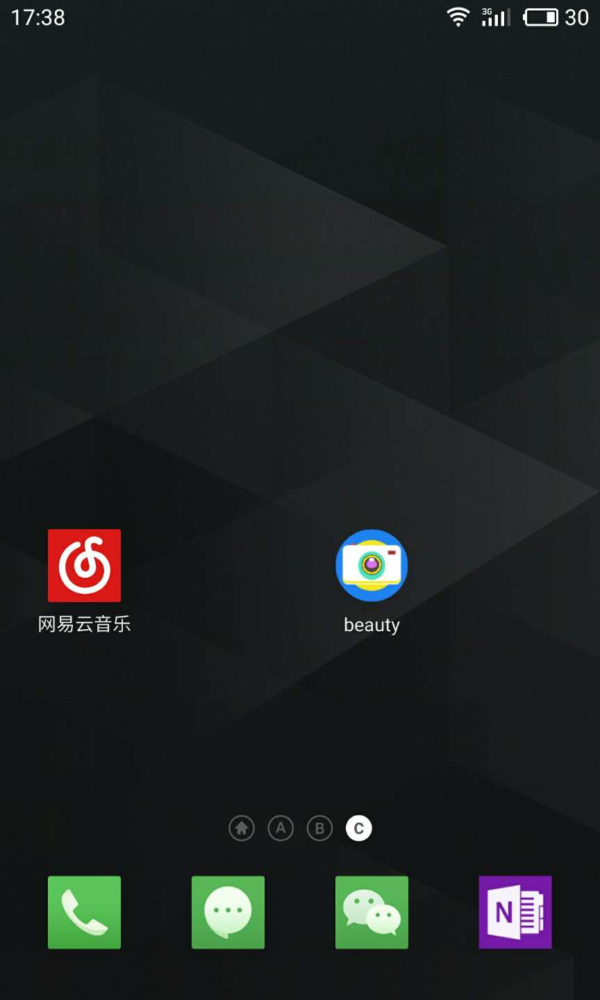
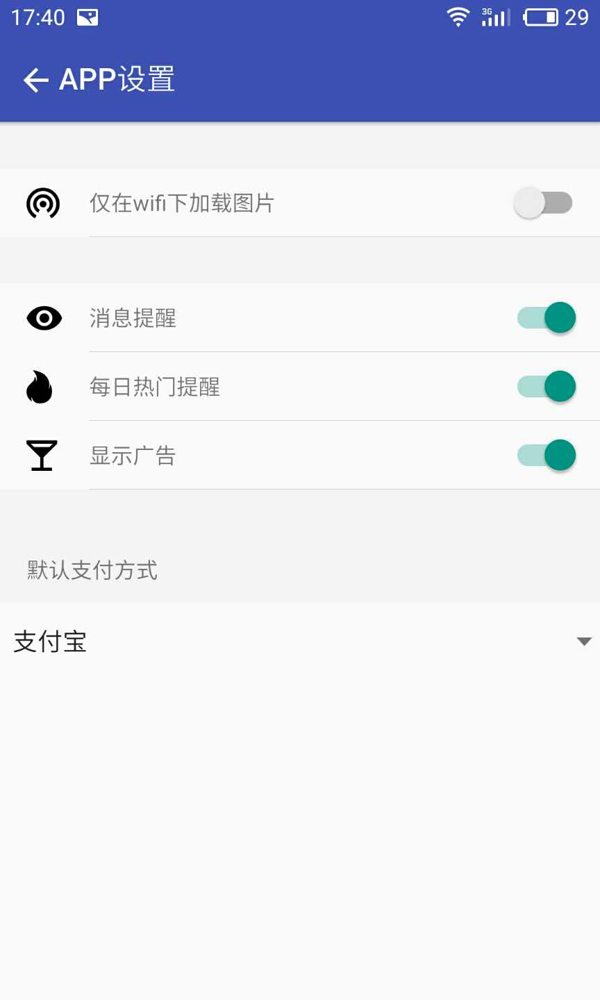
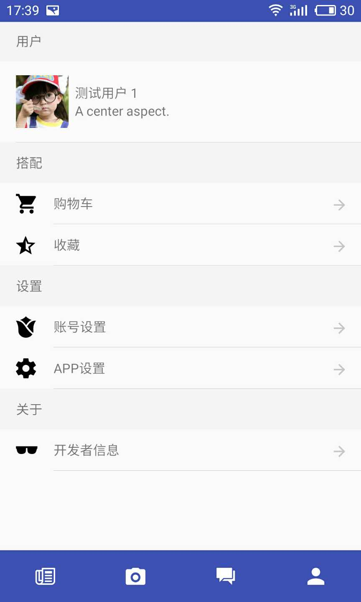

# 开发背景

学校里，我有一门创新创业选修课，其期末作业是展示 idea 的 ppt 原型。打发无聊，所以直接用代码开发了一个 app 原型。开发时，假装的需求是服装购物类app

如果你在学习 react native，不建议把这个项目作为学习资源。因为这个项目只 **用时两天，是纯粹的练手结果**，不一定有学习或者引用的价值（觉得写的不好）。但可以大致浏览一下代码结构，体会一下 react native 的感觉；或者看看截图，增进一下 react native 的学习兴趣。

# 截图

# 使用的开源组件
- native-base
- react-native-gifted-chat
- react-native-swiper

# 不足
- 从选项页返回主页，需要较长时间的加载
- 首屏中，商品展示卡片滑动（有时）不流畅